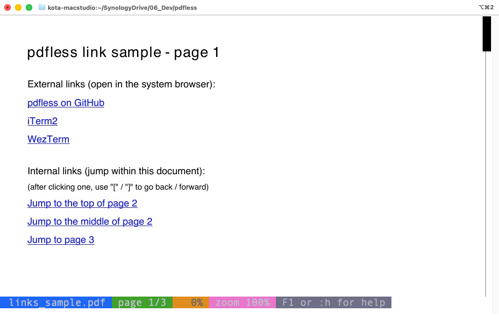
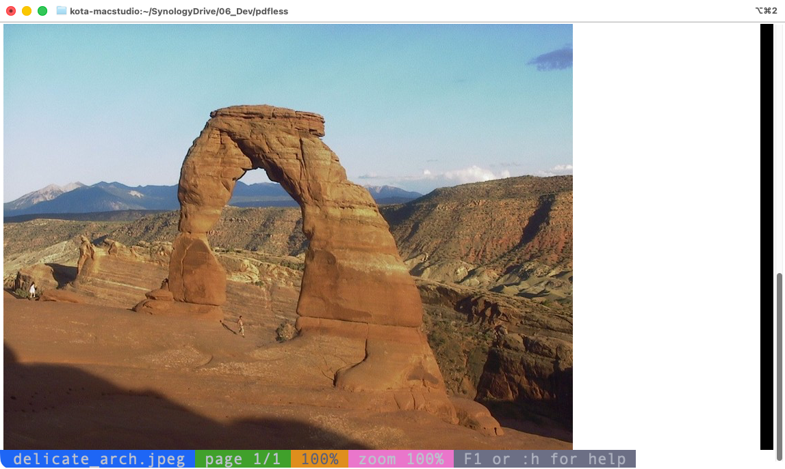
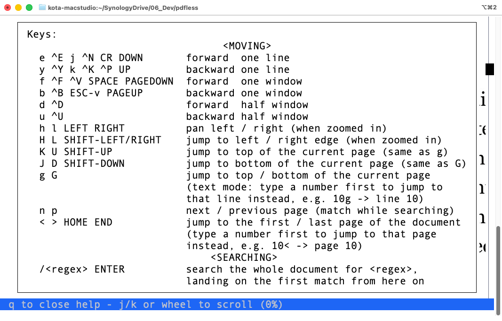

# pdfless

[日本語](README-ja.md)

A full-screen pager for PDFs and images, with familiar `less(1)` keybindings.
View documents directly in your terminal, locally or over SSH.

`pdfless` requires a terminal that supports [iTerm2](https://iterm2.com)'s inline image protocol.
It has been tested with [iTerm2](https://iterm2.com) and
[WezTerm](https://wezterm.org).

- Scroll, zoom, and pan with the keyboard or mouse.
- Search PDF text and follow external and internal PDF links.
- Support password-protected PDFs.
- Switch to text mode to read or copy extracted text.
- Open multiple files and switch between them.
- Reload the current file automatically when it changes (in follow mode).
- Open plain text files and, with additional dependencies, Office documents,
  SVG, and Markdown.

## Screenshots

| View | Screenshot |
| --- | --- |
| Fit to width |  |
| Fit to height |  |
| Zoom and pan |  |
| Search in image mode |  |
| Search in text mode |  |
| PDF hyperlinks |  |
| Image file |  |
| Keyboard help |  |


## Installation

You need Python 3.9+, [uv](https://docs.astral.sh/uv/), and a compatible
terminal. PDF viewing also requires [Poppler](https://poppler.freedesktop.org).
Poppler is not needed for plain image files.

Install the prerequisites:

```sh
# macOS (Homebrew)
brew install uv poppler

# Ubuntu / Debian
sudo apt install poppler-utils
curl -LsSf https://astral.sh/uv/install.sh | sh
```

Clone the repository and open a file. `uv` installs the Python dependencies
automatically on the first run.

```sh
git clone https://github.com/ktabe/pdfless.git
cd pdfless
./pdfless.py document.pdf
```

To run it as `pdfless`, copy the script to a writable directory on your `PATH`:

```sh
cp pdfless.py /usr/local/bin/pdfless
chmod +x /usr/local/bin/pdfless
```

Alternatively, install the Python dependencies and run without `uv`:

```sh
pip install pillow pypdf markdown weasyprint
python3 pdfless.py document.pdf
```

For other document types, see [Additional formats](#additional-formats-experimental).
For use inside tmux, see [Caveats](#caveats).

## Usage

```sh
pdfless document.pdf           # Open a PDF
pdfless image.png              # Open an image
pdfless notes.txt              # Open a text file
pdfless report.pdf chart.png   # Open multiple files
pdfless -p 10 document.pdf     # Start on page 10
pdfless -h slides.pdf          # Fit each page to the terminal height
pdfless -f document.pdf        # Reload when the file changes
pdfless -F document.pdf        # Quit if the document fits on one screen
cat document.pdf | pdfless     # Read from standard input
```

Pages fit the terminal width by default. Use `j` / `k` to scroll,
`Space` / `b` to move by a window, and `n` / `p` to change pages.
Press `+` / `-` to zoom, `/` to search, `t` to switch to text mode,
and `q` to quit. `F1` or `:h` opens the keyboard help.

With multiple files open, use `:n` / `:p` (or `}` / `{`) to switch files.
With no filename, or with `-` as the filename, `pdfless` reads standard input.

### Search and text selection

Search is case-insensitive and supports
[Python regular expressions](https://docs.python.org/3/library/re.html).
An invalid regular expression is treated as literal text. Matches are boxed
in PDF image mode and highlighted in text mode.

While a search is active, `n` / `p` move between matches rather than pages.
Search requires text: it is available for PDFs with extractable text, plain
text files, and supported formats rendered to PDF. It is unavailable for
plain images and previews without extractable text.

To copy text from image mode, press `T` to switch to text mode with borders,
line numbers, end-of-line markers, and the scrollbar hidden. You can also
press `t`, then `C`. If you are already in text mode, use `C` to toggle these
display elements. Select text using the terminal's normal selection controls;
press `C` again to restore the previous display settings.

### Options

| Option | Description |
| --- | --- |
| `--help` | Show command-line help. |
| `-v`, `--version` | Show the version. |
| `-p`, `--page PAGE` | Start on the given page in the first file (default: 1). |
| `-h`, `--fit-height` | Fit pages to the terminal height instead of its width. |
| `-k`, `--keep` | Leave the last page on screen when quitting. |
| `-f`, `--follow` | Start in follow mode: check the current file for changes every 3 seconds and reload it, preserving the page and display mode. |
| `-F`, `--quit-if-one-screen` | Print a single-page document fit to height and quit immediately; in text mode, quit if no scrolling is needed. Otherwise start normally. |
| `-N`, `--line-numbers` | Show line numbers in text mode. |
| `-S`, `--chop-long-lines` | Pan across long lines instead of wrapping them in text mode. |
| `-B`, `--no-border` | Hide page borders in text mode. |
| `-E`, `--no-eol-mark` | Hide end-of-line markers in text mode. |
| `--no-scrollbar` | Hide the scrollbar. |
| `--wheel-scroll-step N` | Scroll N lines per mouse-wheel step in image mode (default: 2). |
| `-s`, `--rendering-scale N` | Set the rendering scale for image-based Quick Look previews (default: 1). Higher values improve sharpness at the cost of rendering time. |
| `-c`, `--continuous` | Use a continuous view for Quick Look previews. |
| `--no-incremental-scroll` | Redraw the full page image on every scroll. |
| `-d`, `--debug` | Print debugging information to standard error. |
| `--no-cache` | Render afresh without reading or writing the persistent cache. |
| `--clear-cache` | Delete the persistent cache and exit without opening any files. |

Note that `-h` means **fit to height**; use `--help` for command-line help.
Follow mode watches only the currently displayed file. Press `F` to toggle
it on or off at any time, or use `-f`/`--follow` to enable it at startup.
The status line shows `follow` while the mode is active.

## Keyboard and mouse controls

`^` denotes Ctrl. Many commands accept the same keys as `less(1)`.

### Navigation

| Keys | Action |
| --- | --- |
| `e`, `^E`, `j`, `^N`, `Enter`, `Down` | Scroll down one line. |
| `y`, `^Y`, `k`, `^K`, `^P`, `Up` | Scroll up one line. |
| `f`, `^F`, `^V`, `Space`, `PageDown` | Scroll forward one window. |
| `b`, `^B`, `Esc-v`, `PageUp` | Scroll backward one window. |
| `d`, `^D` / `u`, `^U` | Scroll forward / backward half a window. |
| `g` / `G` | Go to the top / bottom of the current page. In text mode, prefix with a number to go to that line, e.g. `10g`. |
| `<`, `Home` / `>`, `End` | Go to the first / last page. Prefix with a number to go to that page, e.g. `10<`. |
| `n` / `p` | Next / previous page, or next / previous match while a search is active. |
| `:n` / `:p`, `}` / `{` | Next / previous file. |
| `x` / `X` | First / last file. Prefix `x` with a number to select that file. |

### Zoom and pan

| Keys | Action |
| --- | --- |
| `+`, `=` / `-` | Zoom in / out. |
| `0` | Reset zoom and pan. |
| `m` / `M` | Fit to height / width. |
| `h`, `Left` / `l`, `Right` | Pan left / right. |
| `H`, `Shift-Left` / `L`, `Shift-Right` | Go to the left / right edge. |
| `K`, `U`, `Shift-Up` / `J`, `D`, `Shift-Down` | Go to the top / bottom of the current page. |

### Search

| Keys | Action |
| --- | --- |
| `/pattern` `Enter` | Search forward. |
| `?pattern` `Enter` | Search backward. |
| `/` `Enter` / `?` `Enter` | Repeat the previous pattern forward / backward. |
| `N` / `P` | Next / previous match. |

While entering a search pattern with `/` or `?`, use the following keys to
edit the input. These bindings apply only while the search prompt is active.

| Keys | Action |
| --- | --- |
| `^B`, `Left` | Move the cursor one character left. |
| `^F`, `Right` | Move the cursor one character right. |
| `^A` | Move to the beginning of the input. |
| `^E` | Move to the end of the input. |
| `^U` | Delete from the cursor to the beginning of the input. |
| `^K` | Delete from the cursor to the end of the input. |
| `^D`, `Delete` | Delete the character to the right of the cursor. |
| `^H`, `Backspace` | Delete the character to the left of the cursor. |

### Display and interaction

| Keys or gesture | Action |
| --- | --- |
| `t` | Toggle text mode: extracted text for supported documents, raw source for Markdown, or image information and metadata for image files. |
| `T` | Toggle text mode with a clean display for copying, combining the functions of `t` and `C`. |
| `B` | Toggle page borders in text mode (on by default, except for plain text files, which never show one). Borders are hidden while lines wrap. |
| `s`, `-S` | Toggle line wrapping in text mode. Plain text wraps by default; other formats do not. |
| `E` | Toggle end-of-line markers in text mode (shown by default). |
| `#`, `-N` | Toggle line numbers in text mode (hidden by default). |
| `C` | Toggle a clean text display for copying, restoring previous settings on the second press. |
| `r` | Toggle the scrollbar (shown by default). |
| `F` | Toggle automatic reloading when the current file changes. Follow mode is off at startup unless `-f`/`--follow` is specified. |
| Click a PDF link | Open a URL in the system browser or follow an internal link. |
| `[` / `]` | Go back / forward through internal-link navigation history. |
| Click or drag the scrollbar | Jump to a document position in image mode. In text mode, the scrollbar is display-only. |
| Mouse wheel | Scroll by two lines in image mode (configurable) or one line in text mode. |
| `O`, `v` | Open the file in its default app (macOS only) and switch follow mode on, so an edit made there is picked up automatically. |
| `^L` | Redraw the screen. |
| `F1`, `:h` | Show keyboard help; press `q` to close it. |
| `q`, `:q`, `^C` | Quit. |

## Additional formats (experimental)

PNG, JPEG, and other image formats supported by
[Pillow](https://python-pillow.org) open directly. Press `t` or `T` to view
image information in text mode, including the filename, format, pixel
dimensions, color mode, file size, DPI, and transparency.

EXIF metadata and embedded text chunks are also shown when present. GPS
metadata includes decimal latitude and longitude and a coordinate pair you
can paste into Google Maps. Embedded text may include screenshot-tool tags
or AI image-generation prompts.

The formats below require additional software. PDF-based rendering also
requires Poppler.

### Optional dependencies

- **LibreOffice** enables OpenDocument, Visio, and WMF support. When installed,
  it is also preferred for Word, RTF, and PowerPoint rendering.
- **macOS Quick Look and Chrome/Chromium** enable Excel and iWork previews and
  provide a fallback for Word, RTF, and PowerPoint when LibreOffice is absent.
- **Chrome/Chromium** enables SVG rendering without Quick Look.
- **WeasyPrint system libraries** enable Markdown rendering. The Python
  packages `markdown` and `weasyprint` are installed with the other Python
  dependencies.

```sh
# macOS (Homebrew)
brew install --cask libreoffice
brew install cairo pango gdk-pixbuf libffi

# Ubuntu / Debian
sudo apt install libreoffice
sudo apt install libpango-1.0-0 libpangocairo-1.0-0 libgdk-pixbuf2.0-0
```

Install Chrome or Chromium separately if you need Quick Look or SVG rendering.

### Format support and limitations

Preview quality and pagination depend on the format and available renderer.

| Format | Extensions | Requirements and behavior |
| --- | --- | --- |
| Word | `.doc`, `.docx`, `.docm` | LibreOffice preferred; otherwise Quick Look + Chrome. Supports text mode and search. Pagination may differ with the fallback renderer. |
| Excel | `.xls`, `.xlsx`, `.xlsm` | Quick Look + Chrome. One page per sheet; no text mode or search. |
| PowerPoint | `.ppt`, `.pptx`, `.pptm` | LibreOffice preferred; otherwise Quick Look + Chrome. One page per slide. Text mode and search require LibreOffice. |
| RTF | `.rtf` | LibreOffice preserves page breaks; the Quick Look + Chrome fallback uses a continuous view. Supports text mode and search, with a plain-text fallback if rendering is unavailable. |
| Pages | `.pages` | Quick Look + Chrome. Continuous view; no text mode or search. |
| Numbers | `.numbers` | Quick Look + Chrome. Only the first sheet is shown; no text mode or search. |
| Keynote | `.key` | Quick Look + Chrome. Usually continuous; some previews support per-slide paging. No text mode or search. |
| OpenDocument | `.odt`, `.odp`, `.odg`, `.ods` | LibreOffice required. Supports text mode and search. Spreadsheet pagination follows the print layout. |
| Visio | `.vsd`, `.vsdx` | LibreOffice required. One page per Visio page. `.vsdx` support has not been manually verified. |
| WMF | `.wmf` | LibreOffice required. Single-page view. |
| SVG | `.svg` | Chrome/Chromium. Scalable rendering; links within the SVG are not clickable. Falls back to XML source if Chrome is unavailable. |
| Markdown | `.md`, `.markdown` | WeasyPrint and its system libraries. Paginated view with search and clickable links. `t` shows the raw Markdown source; falls back to source-only display if rendering is unavailable. |

Formats rendered to PDF support text extraction and search where the resulting
PDF contains text. Image-based Quick Look previews do not. In Markdown preview
mode, `/` searches the rendered PDF; press `t` first to search the raw source.

Use `-s` to increase the resolution of image-based Quick Look previews and
`-c` to request continuous scrolling for Quick Look documents. These options
do not change the pagination or resolution of LibreOffice-only formats or Markdown.
Excel uses Quick Look's sheet-based view rather than LibreOffice's print layout.

## Cache

Rendered output is saved in a persistent cache to reduce loading time when
reopening the same file. Caching is supported for Word, Excel, PowerPoint,
RTF, Keynote, Pages, and SVG. When the source file changes, the output is
rendered again and the cache is updated automatically.

Use `--no-cache` to render without reading or writing the cache, or
`--clear-cache` to delete it and exit. The cache directory is shown in `--help`.

## Caveats

### tmux

For image display in tmux 3.3 or later, add the following to `~/.tmux.conf`:

```tmux
set -g allow-passthrough on
set -g focus-events on
```

Reload the configuration:

```sh
tmux source-file ~/.tmux.conf
```

Passthrough enables image output; without it, tmux does not display the images.

Switching away from a pane running `pdfless` can leave that pane blank because
tmux redraws it without the passed-through image. With focus events enabled,
`pdfless` redraws automatically when you return to the pane. Press `Ctrl-L`
to redraw manually if needed.

## Development

Run the test suite:

```sh
cd tests
uv run --with pytest --with pytest-timeout --with pillow --with pypdf --with markdown --with weasyprint python -m pytest
```

The suite includes unit tests and terminal-based integration tests.
Tests that depend on macOS Quick Look + Chrome/Chromium, LibreOffice
(`soffice`), or WeasyPrint are automatically skipped when those dependencies
aren't available.

## Acknowledgements

The code for this program was written by [Claude Code](https://claude.com/claude-code).

## License

[MIT](LICENSE)
