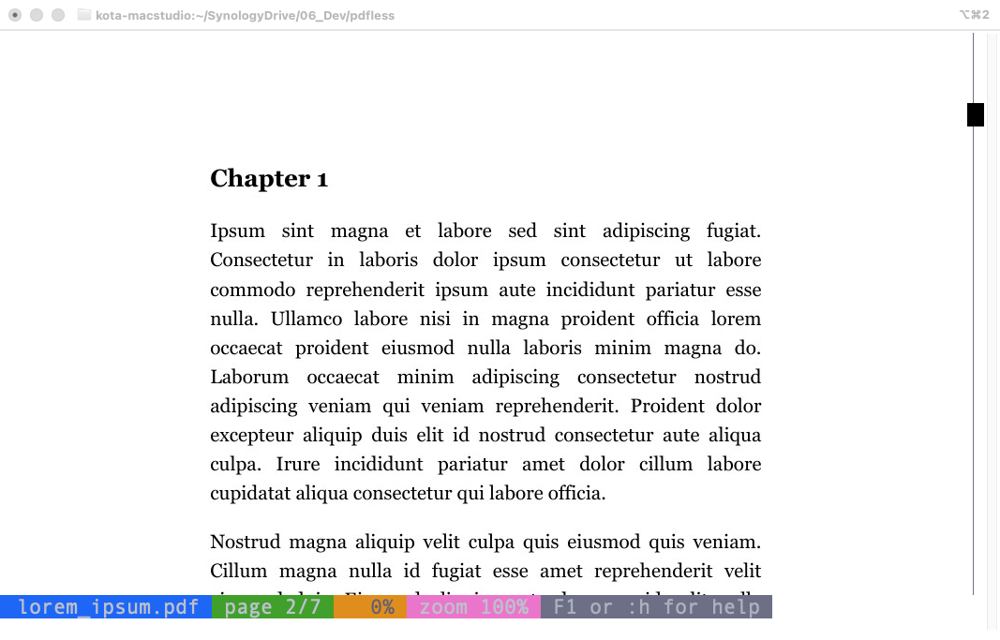
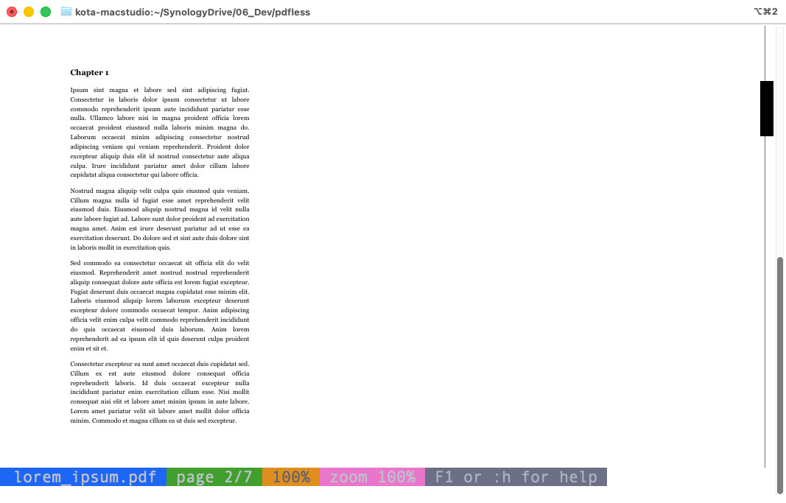
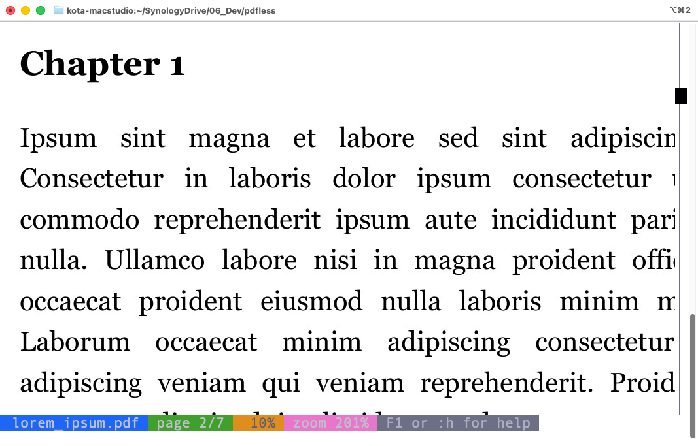
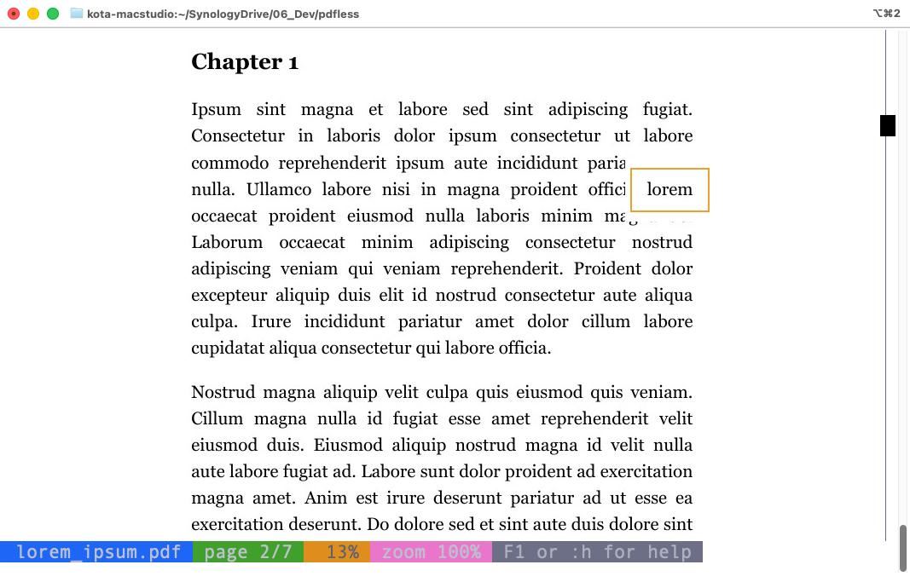
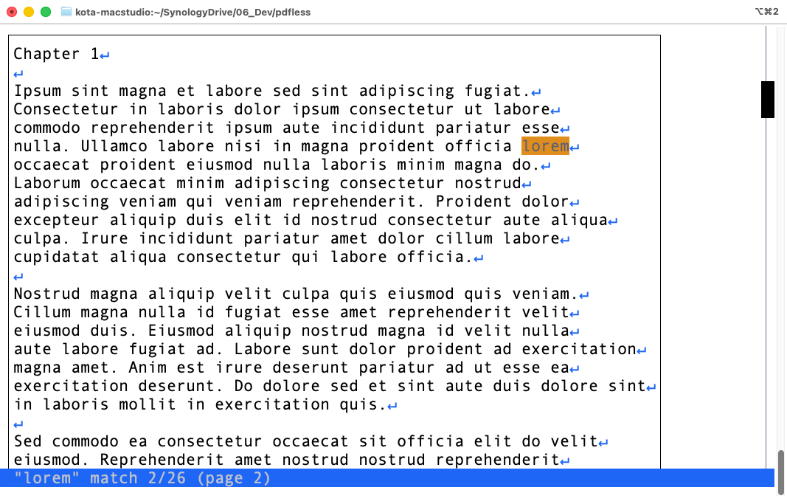

# pdfless

*([日本語](README-ja.md))*

A `less(1)`-like full-screen pager for PDFs and images, for terminals
that support [iTerm2](https://iterm2.com)'s inline image protocol.
Confirmed working on iTerm2 and [WezTerm](https://wezterm.org).

Lets you view a PDF (or a plain image - PNG, JPEG, and whatever else
[Pillow](https://python-pillow.org) can decode) right in the terminal,
using almost the same keybindings as `less(1)` — scroll by line, by
half/full window, jump to a page, and so on. On top of that, since a
page is an image rather than text, `pdfless` also supports zooming in
and out.

For a PDF, `pdfless` also has a plain-text mode, which extracts the
text from the page — handy for copying text out. You can switch
between image mode and text mode any time with `t`.

You can also search a PDF's whole document with a regex, jumping
straight to each match. Searching works in both image mode and text
mode. (Text mode and search aren't available for a plain image, which
has no text to extract.)

PDF hyperlinks are clickable in the page image — both external URLs
(opened in your system browser) and internal links to another page in
the same document. The mouse wheel is supported too, for scrolling.

You can also open more than one file at once (`pdfless a.pdf b.png ...`)
and switch between them with `:n`/`:p`, `less(1)`-style.

Since it's just a terminal program, it works the same way over SSH — no
X11 forwarding, and no need to copy the PDF to your local machine first.

## Screenshots

<p align="center">
  <br>
  <em>Fit to width (default)</em>
</p>

<p align="center">
  <br>
  <em>Fit to height (<code>-h</code>)</em>
</p>

<p align="center">
  <br>
  <em>Zoomed in and panned</em>
</p>

<p align="center">
  <br>
  <em>Search — PDF mode, match boxed</em>
</p>

<p align="center">
  <br>
  <em>Search — text mode, match highlighted</em>
</p>

## Requirements

- A terminal that supports iTerm2's inline image protocol — confirmed
  working on [iTerm2](https://iterm2.com) and
  [WezTerm](https://wezterm.org); terminals
  without this protocol will not display anything.
- [poppler](https://poppler.freedesktop.org) (`pdftoppm` / `pdfinfo`) -
  only needed for viewing PDFs; not required at all if you only ever
  open plain image files.
- Python 3.9+
- [uv](https://docs.astral.sh/uv/)

## Installation

Install poppler, which provides the `pdftoppm`/`pdfinfo` binaries `pdfless`
shells out to:

```sh
# macOS (Homebrew)
brew install poppler

# Ubuntu/Debian (apt)
sudo apt install poppler-utils
```

`pdfless.py` is a self-contained [PEP 723](https://peps.python.org/pep-0723/)
script — its Python dependencies are declared inline, so
[`uv`](https://docs.astral.sh/uv/) will install them automatically on
first run:

```sh
# macOS (Homebrew)
brew install uv

# Ubuntu/Debian and other Linux (uv isn't in apt; use the official installer)
curl -LsSf https://astral.sh/uv/install.sh | sh
```

```sh
git clone https://github.com/ktabe/pdfless.git
cd pdfless
./pdfless.py some.pdf
```

Or drop it on your `$PATH`:

```sh
cp pdfless.py /usr/local/bin/pdfless
chmod +x /usr/local/bin/pdfless
pdfless some.pdf
```

Without `uv`, install its Python dependencies yourself and run it with
`python3` directly:

```sh
pip install pillow pypdf
python3 pdfless.py some.pdf
```

## Usage

```
usage: pdfless [--help] [-v] [-p PAGE] [-k] [-h] [--no-frame] [-F]
               [--wheel-scroll-step N] file [file ...]

positional arguments:
  file                    path to one or more PDF or image files

options:
  --help                  show this help message and exit
  -v, --version           show program's version number and exit
  -p, --page PAGE         page to start on, in the first file (default: 1)
  -k, --keep              leave the last page on screen when quitting (q or
                          ^C) instead of restoring the terminal screen
  -h, --fit-height        fit each page to the terminal's full height
                          instead of its full width (default: fit width)
  --no-frame              don't draw a border around the page's edges in
                          text mode (t); on by default, toggle any time
                          with f
  -F, --follow            watch the file and reload it if it changes on
                          disk (checked every 3s), staying on the same page
                          and in the same mode
  --wheel-scroll-step N   scroll N lines per mouse wheel step, in the page
                          image (default: 1)
```

`-F`/`--follow` is handy while editing/regenerating a PDF or image (e.g.
from a build script, a LaTeX watch loop, or a script re-rendering a PNG) —
pdfless picks up each rebuild automatically, without losing your place.
With multiple files open, it only watches whichever one is currently
displayed, switching what it watches along with `:n`/`:p`.

## Keys

Navigation mirrors `less(1)`:

| Keys | Action |
| --- | --- |
| `e` `^E` `j` `^N` `Enter` `Down` | forward one line |
| `y` `^Y` `k` `^K` `^P` `Up` | backward one line |
| `f` `^F` `^V` `Space` `PageDown` | forward one window |
| `b` `^B` `Esc-v` `PageUp` | backward one window |
| `d` `^D` | forward half window |
| `u` `^U` | backward half window |
| `g` / `Home` | first page |
| `G` / `End` | last page |
| `<N> g` | jump straight to page `N` |
| `n` / `p` | next / previous page (see below for their other job during a search) |
| `:n` / `:p` | next / previous file, when more than one was given on the command line |
| `x` / `X` | jump to the first / last file in the list |
| `<N> x` | jump straight to file `N` |

Zoom and pan:

| Keys | Action |
| --- | --- |
| `+` / `-` | zoom in / out |
| `0` | reset zoom and pan |
| `m` / `M` | fit page to terminal height / width |
| `h` / `l` / `Left` / `Right` | pan left / right (when zoomed in) |
| `H` / `L` / `Shift-Left` / `Shift-Right` | jump to left / right edge |
| `K` / `U` / `Shift-Up` | jump to top of the current page |
| `J` / `D` / `Shift-Down` | jump to bottom of the current page |

Search (PDFs only - a case-insensitive [Python regex](https://docs.python.org/3/library/re.html)
against the PDF's extracted text, across the whole document — not just
the current page; falls back to a literal substring match if the
pattern isn't valid regex syntax, e.g. `C++`). Jumping to a match
scrolls it into view and draws a box around it:

| Keys | Action |
| --- | --- |
| `/<regex>` `Enter` | search the whole document for `<regex>` |
| `N` / `P` | jump to the next / previous match |
| `n` / `p` | while a search is active, the same as `N` / `P` above (otherwise next / previous page) |

Misc:

| Keys | Action |
| --- | --- |
| click | (page image, not text mode) open a PDF hyperlink under the pointer - a URL in the system browser, or an internal link by jumping to its target page/position |
| mouse wheel | scroll up / down - in the page image, one line at a time like `e`/`y` (`--wheel-scroll-step` to change that); in text mode, the terminal turns it into `Up`/`Down` key presses instead, so it still works there without clashing with click-drag text selection |
| `[` / `]` | back / forward, through the positions internal links have jumped from |
| `t` | toggle a plain-text view of the current page (its extracted text, scrollable by page/line, and `h`/`l`/`H`/`L` pan for lines wider than the terminal) - PDFs only; on a plain image, this just reports that there's no text to show |
| `f` | (text mode) toggle a border around the page's edges - on by default (`--no-frame` to start with it off) |
| `^L` | redraw the screen |
| `?` | show a keybinding help box (`q` to close it) |
| `q` / `^C` | quit |

## Acknowledgements

The code of this program was written by [Claude Code](https://claude.com/claude-code).

## License

[MIT](LICENSE)
