# *pdfless*

[日本語](README-ja.md)

A full-screen pager for PDFs and images, with familiar `less(1)` keybindings.
View documents directly in your terminal, locally or over SSH.

`pdfless` requires a terminal that supports [iTerm2](https://iterm2.com)'s inline image protocol.
It has been tested with [iTerm2](https://iterm2.com) and
[WezTerm](https://wezterm.org).

---

## Major Features

- Display PDF, image (PNG/JPEG/GIF...), and plain text files on a terminal.
- Office documents, SVG, and Markdown are also supported with additional dependencies.
- Scroll, zoom, and pan with the keyboard or mouse.
- View paginated documents continuously, with adjacent pages on screen together.
- Search PDF text and follow external and internal PDF links.
- Jump to a section from the table of contents: a PDF's bookmarks, Markdown
  headings, and Word headings or PowerPoint slide titles (with LibreOffice).
- Switch to text mode to read or copy extracted text.
- Show a clickable and draggable scrollbar.
- Show page thumbnails down the left edge, and click one to go to its page.
- Open multiple files and switch between them.
- Reload the current file automatically when it changes (in follow mode).

## Installation

You need Python 3.9+, [uv](https://docs.astral.sh/uv/), and a compatible
terminal. PDF viewing also requires [Poppler](https://poppler.freedesktop.org).
Poppler is not needed for plain image files.

Install the prerequisites:

```sh
# macOS (Homebrew)
brew install uv poppler

# Ubuntu / Debian
sudo apt install poppler-utils
curl -LsSf https://astral.sh/uv/install.sh | sh
```

Clone the repository and open a file. `uv` installs the Python dependencies
automatically on the first run.

```sh
git clone https://github.com/ktabe/pdfless.git
cd pdfless
./pdfless.py document.pdf
```

To run it as `pdfless`, copy the script to a writable directory on your `PATH`:

```sh
cp pdfless.py /usr/local/bin/pdfless
chmod +x /usr/local/bin/pdfless
```

Alternatively, install the Python dependencies and run without `uv`:

```sh
pip install pillow pypdf markdown weasyprint merm
python3 pdfless.py document.pdf
```

For other document types, see [Additional formats](#additional-formats-experimental).
For use inside tmux, see [Caveats](#caveats).

## Usage

```sh
pdfless document.pdf           # Open a PDF
pdfless image.png              # Open an image
pdfless notes.txt              # Open a text file
pdfless report.pdf chart.png   # Open multiple files
pdfless slides/                # Open the files in a directory
pdfless -p 10 document.pdf     # Start on page 10
pdfless -h slides.pdf          # Fit each page to the terminal height
pdfless -f document.pdf        # Reload when the file changes
pdfless -F document.pdf        # Quit if the document fits on one screen
cat document.pdf | pdfless     # Read from standard input
```

With multiple files open, use `:n` / `:p` (or `}` / `{`) to switch files, or `O` to pick one from a list.
A directory stands for the files directly in it, sorted by name (ignoring case, as `ls` does); hidden files and subdirectories are left out.
With no filename, or with `-` as the filename, `pdfless` reads standard input.

## Common operations

The following examples show common ways to adjust the view and move through a
document. The complete list of keyboard and mouse controls is in
[Keyboard and mouse controls](#keyboard-and-mouse-controls).

### Fit and navigate pages

Pages fit the terminal width by default. Press `m` to fit the current page to
the terminal height, or `M` to return to fitting it to the width.

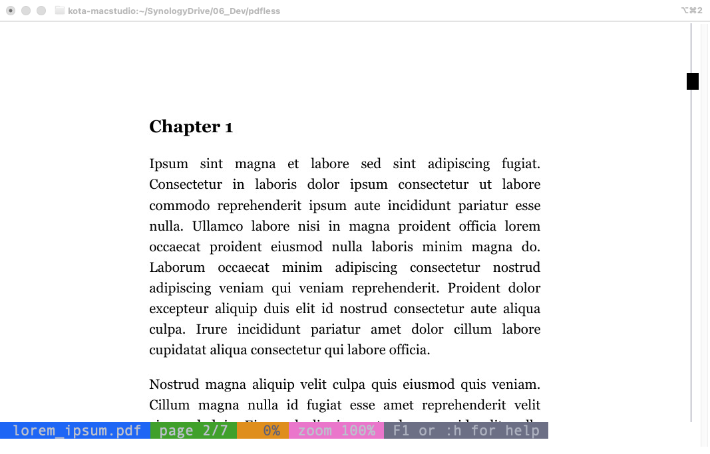

Press `+` / `-` to zoom in or out. Use `h` / `l` (or the arrow keys) to pan,
and press `0` to reset the zoom and position.

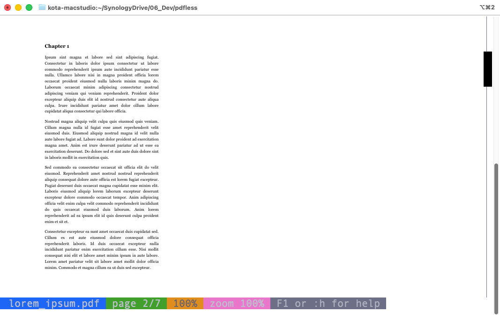

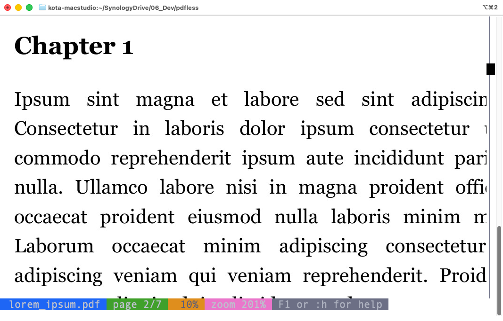

### Search

Press `/` and enter a pattern to search forward, or `?` to search backward.
Matches are boxed in image mode and highlighted in text mode. Use `n` / `p` to
move between matches.

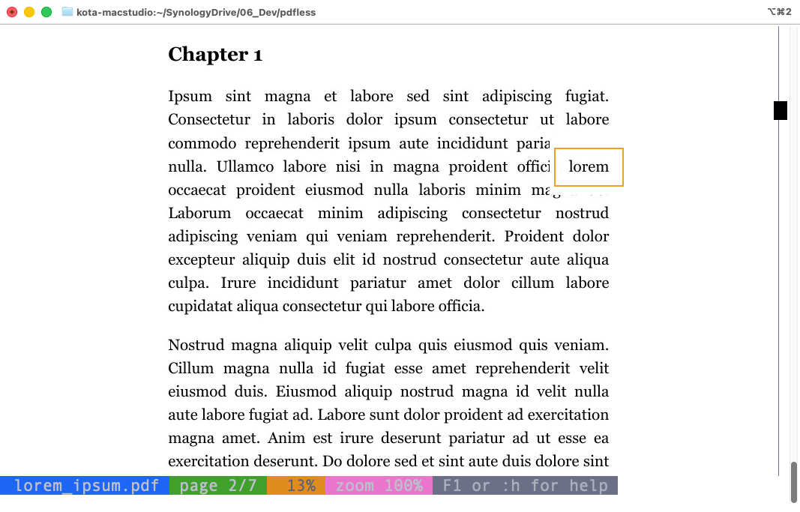

Press `t` to switch to extracted text, then search or copy it using the
terminal's normal selection controls. Press `T` to switch directly to a clean
copying view.

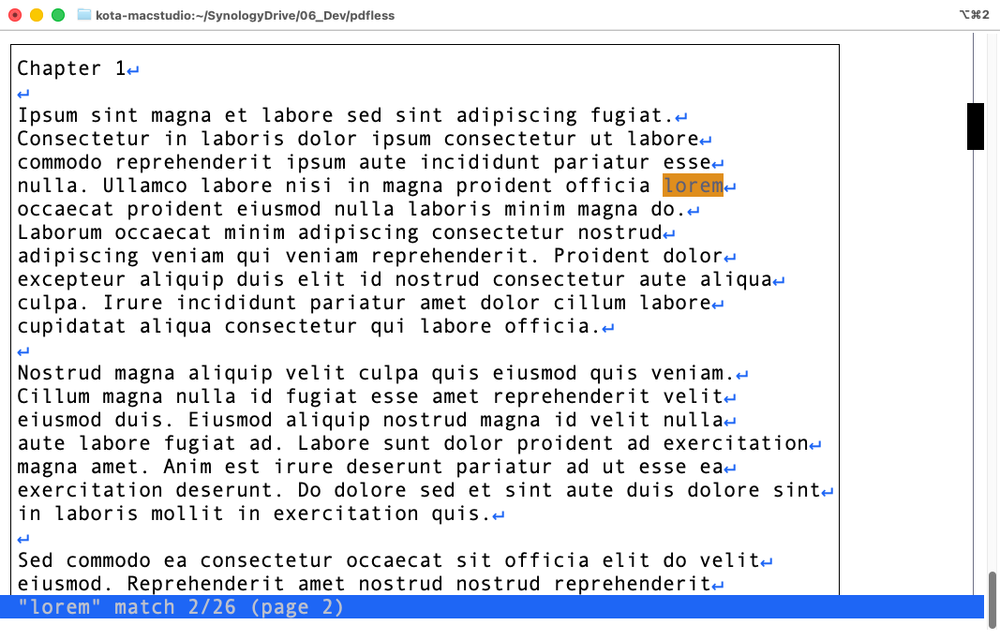

### Table of contents

Press `o` or `TAB` to open the table of contents. Select a heading with `j` /
`k` or the mouse, then press `ENTER` or click it to jump to that section. Use
`[` / `]` to go back and forward through positions jumped to from the outline
or an internal link.

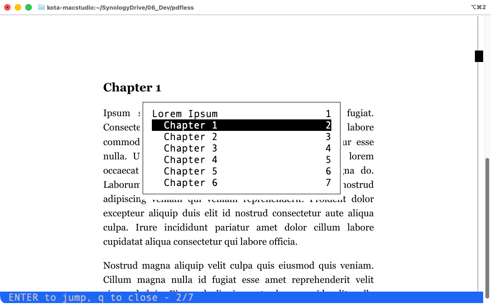

### PDF hyperlinks

Click a PDF link to open an external URL in the system browser or follow an
internal link. The `[` / `]` keys return to the previous or next position.

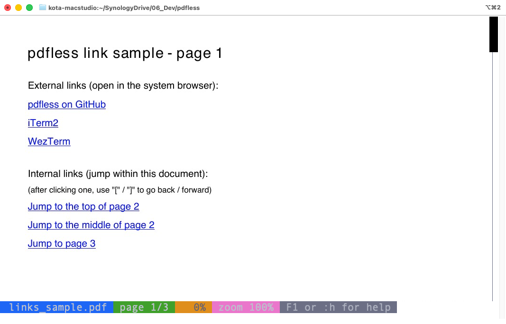

### Choose a file

When multiple files are open, press `O` to show the file chooser. Move with
`j` / `k` or the mouse wheel, then press `ENTER` or click a file to open it.
Press `q` to close the chooser. `:n` / `:p` and `}` / `{` switch to the next
or previous file without opening the chooser.

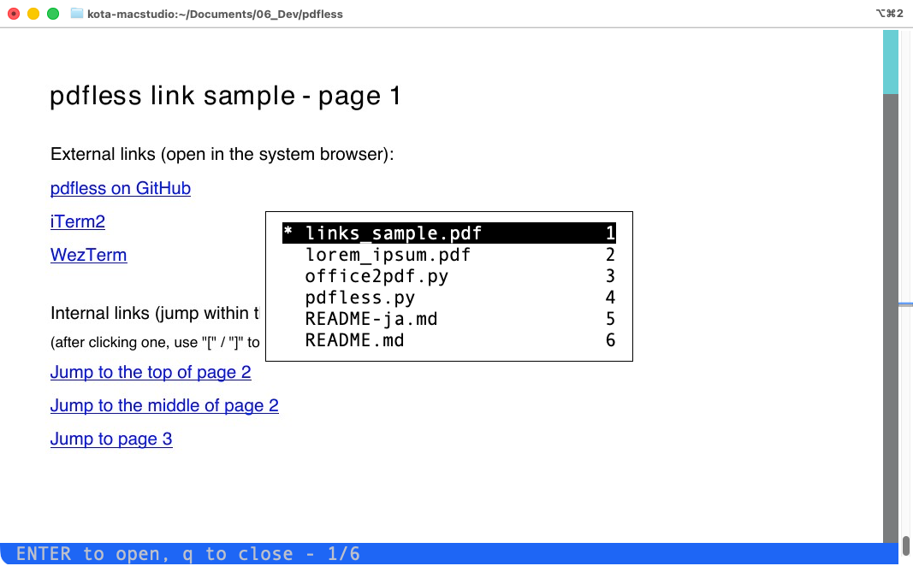

### Page thumbnails

In image mode, press `S` to show or hide page thumbnails on the left. The
current page is framed, and clicking a thumbnail moves to that page. Press
`s` to move focus to the thumbnails; select one with `j` / `k` and press
`ENTER` to open it. Press `q` or `s` to return to the page while leaving the
thumbnails visible. The sidebar requires a terminal at least 60 columns wide.

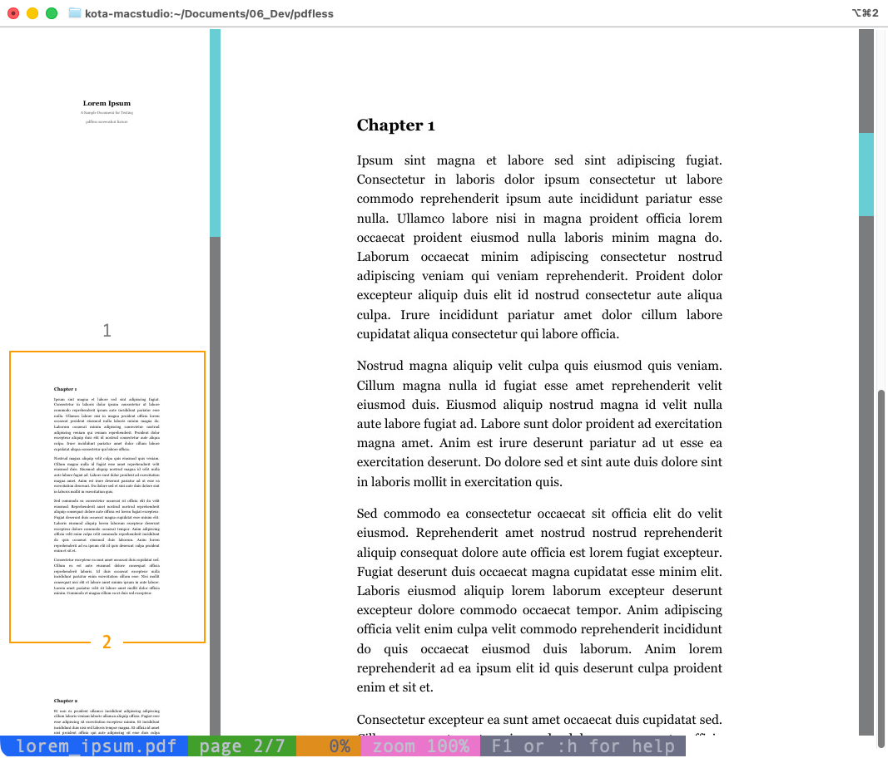

### Other display modes

Press `c` to toggle continuous mode. This displays the pages continuously, so
you can scroll from one page to the next without switching pages.


Image files open directly in image mode. Press `t` or `T` to view image
information and metadata in text mode.

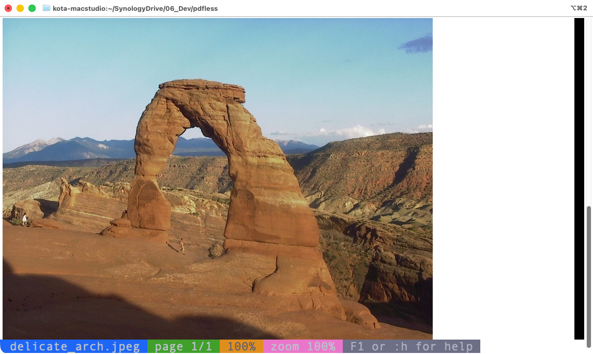

Press `F1` or `:h` to open the keyboard help. Press `q` to close it.

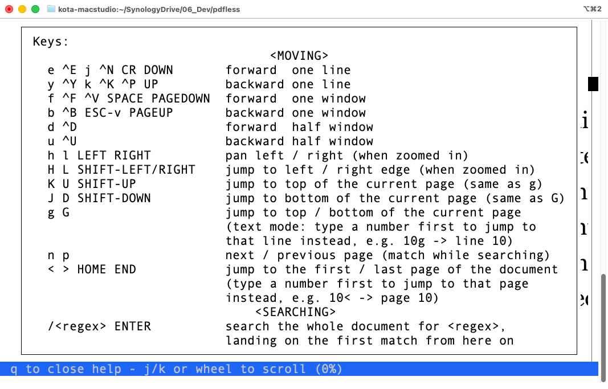

### Options

| Option | Description |
| --- | --- |
| `--help` | Show command-line help. |
| `-v`, `--version` | Show the version. |
| `-p`, `--page PAGE` | Start on the given page in the first file (default: 1). |
| `-h`, `--fit-height` | Fit pages to the terminal height instead of its width. |
| `-k`, `--keep` | Leave the last page on screen when quitting. |
| `-f`, `--follow` | Start in follow mode: check the current file for changes every 3 seconds and reload it, preserving the page and display mode. |
| `-F`, `--quit-if-one-screen` | Print a single-page document fit to height and quit immediately; in text mode, quit if no scrolling is needed. Otherwise start normally. Applies only when one file is given. |
| `-N`, `--line-numbers` | Show line numbers in text mode. |
| `-S`, `--chop-long-lines` | Pan across long lines instead of wrapping them in text mode. |
| `-B`, `--no-border` | Hide page borders in text mode. |
| `-E`, `--no-eol-mark` | Hide end-of-line markers in text mode. |
| `--no-scrollbar` | Hide the scrollbar. |
| `--sidebar` | Show page thumbnails down the left edge in image mode. Toggle at any time with `S`; `s` moves to them to pick one. |
| `--wheel-scroll-step N` | Scroll N lines per mouse-wheel step in image mode (default: 2). |
| `-s`, `--rendering-scale N` | Set the rendering scale for image-based Quick Look previews (default: 1). Higher values improve sharpness at the cost of rendering time. |
| `-c`, `--continuous` | Scroll through pages continuously, so the bottom of one page and the top of the next can be on screen together. In text mode, a paginated document (PDF, or a format rendered to PDF) is shown as one run of text with a separator line between pages. Toggle at any time with `c`. |
| `--no-incremental-scroll` | Redraw the full page image on every scroll. |
| `-d`, `--debug` | Print debugging information to standard error. |
| `--remote-resources` | Let a Markdown file load images and stylesheets from the network. By default only local files (such as a relative-path image) are loaded, so viewing a file never makes network requests. |
| `--no-cache` | Render afresh without reading or writing the persistent cache. |
| `--clear-cache` | Delete the persistent cache and exit without opening any files. |

Note that `-h` means **fit to height**; use `--help` for command-line help.
Follow mode watches only the currently displayed file. Press `F` to toggle
it on or off at any time, or use `-f`/`--follow` to enable it at startup.
The status line shows `follow` while the mode is active.

## Keyboard and mouse controls

`^` denotes Ctrl. Many commands accept the same keys as `less(1)`.

### Navigation

| Keys | Action |
| --- | --- |
| `e`, `^E`, `j`, `^N`, `Enter`, `Down` | Scroll down one line. |
| `y`, `^Y`, `k`, `^K`, `^P`, `Up` | Scroll up one line. |
| `f`, `^F`, `^V`, `Space`, `PageDown` | Scroll forward one window. |
| `b`, `^B`, `Esc-v`, `PageUp` | Scroll backward one window. |
| `d`, `^D` / `u`, `^U` | Scroll forward / backward half a window. |
| `g` / `G` | Go to the top / bottom of the current page. In text mode, prefix with a number to go to that line, e.g. `10g`. |
| `<`, `Home` / `>`, `End` | Go to the first / last page. Prefix with a number to go to that page, e.g. `10<`. |
| `n` / `p` | Next / previous page, or next / previous match while a search is active. |
| `:n` / `:p`, `}` / `{` | Next / previous file. |
| `x` / `X` | First / last file. Prefix `x` with a number to select that file. |
| `O` | List the files, with the current one selected. Move with `j`/`k` or the mouse wheel, then press `ENTER` or click a file to open it. Press `q` to close the list. |

### Zoom and pan

| Keys | Action |
| --- | --- |
| `+`, `=` / `-` | Zoom in / out. |
| `0` | Reset zoom and pan. |
| `m` / `M` | Fit to height / width. |
| `h`, `Left` / `l`, `Right` | Pan left / right. |
| `H`, `Shift-Left` / `L`, `Shift-Right` | Go to the left / right edge. |
| `K`, `U`, `Shift-Up` / `J`, `D`, `Shift-Down` | Go to the top / bottom of the current page. |

### Search

| Keys | Action |
| --- | --- |
| `/pattern` `Enter` | Search forward. |
| `?pattern` `Enter` | Search backward. |
| `/` `Enter` / `?` `Enter` | Repeat the previous pattern forward / backward. |
| `N` / `P` | Next / previous match. |
| `q`, `Esc` | While a search is active, clear it (a second `q` quits). |

While entering a search pattern with `/` or `?`, use the following keys to
edit the input. These bindings apply only while the search prompt is active.

| Keys | Action |
| --- | --- |
| `^B`, `Left` | Move the cursor one character left. |
| `^F`, `Right` | Move the cursor one character right. |
| `^A` | Move to the beginning of the input. |
| `^E` | Move to the end of the input. |
| `^U` | Delete from the cursor to the beginning of the input. |
| `^K` | Delete from the cursor to the end of the input. |
| `^D`, `Delete` | Delete the character to the right of the cursor. |
| `^H`, `Backspace` | Delete the character to the left of the cursor. |
| `^T` | Toggle whether a regular expression may match across line breaks (shown as `Multi-line` in the prompt). |
| `Esc`, `^C` | Cancel the search. |

Search is case-insensitive and supports
[Python regular expressions](https://docs.python.org/3/library/re.html).
Before matching, it normalizes Unicode width and composition (NFKC):
`第5回` finds `第５回`, `データ` finds half-width `ﾃﾞｰﾀ` or decomposed kana,
and `file` finds the `fi` ligature. Spaces next to Japanese or Chinese text
are ignored, so `プロジェクトX` also finds the `プロジェクト X` a Word
document's PDF often reads as. Elsewhere, any run of spaces matches one space.

The kind of pattern determines how line breaks are handled:

- A pattern without regular-expression syntax is searched as a literal string
  and may cross line breaks. An invalid regular expression is also treated as
  literal text.
- A valid regular expression matches within one printed line, as in `less`.
  While entering the pattern, press `^T` to toggle `Multi-line` mode and let
  it match across line breaks as well.

For example:

| Pattern | Also finds |
| --- | --- |
| `第5回` | `第５回` |
| `プロジェクトX` | `プロジェクト X` |
| `project plan` | `project` at the end of one line and `plan` at the start of the next |
| `project.*plan` with `^T` | `project` and `plan` across one or more line breaks |

Matches are boxed in PDF image mode and highlighted in text mode.

Search requires text: it is available for PDFs with extractable text, plain
text files, and supported formats rendered to PDF. It is unavailable for
plain images and previews without extractable text. While a search is active,
`n` / `p` move between matches rather than pages.

### Display and interaction

| Keys or gesture | Action |
| --- | --- |
| `t` | Toggle text mode: extracted text for supported documents, raw source for Markdown, or image information and metadata for image files. The view stays at the same place in the document. |
| `T` | Toggle text mode with a clean display for copying, combining the functions of `t` and `C`. |
| `B` | Toggle page borders in text mode (on by default, except for a plain text file and a Markdown file's source, which start without one). Borders are hidden while lines wrap. |
| `W`, `-S` | Toggle line wrapping in text mode. Plain text wraps by default; other formats do not. |
| `E` | Toggle end-of-line markers in text mode (shown by default). |
| `#`, `-N`, `-n` | Toggle line numbers in text mode (hidden by default). |
| `C` | Toggle a clean text display for copying, restoring previous settings on the second press. |
| `c` | Toggle continuous view (`-c`/`--continuous`) in image or text mode while keeping the current position. |
| `r` | Toggle the scrollbar (shown by default). |
| `S` | Show or hide page thumbnails down the left edge (image mode, in a terminal at least 60 columns wide). The page being viewed is framed. Click a thumbnail to go to its page; the mouse wheel over them, or their own scrollbar on the right of them, scrolls them. |
| `s` | Move to the page thumbnails (showing them if needed) to pick one: move with `j`/`k`, press `ENTER` to go to that page (`t`/`T`: in text mode), or `q`/`s` to go back to the page with the thumbnails left up. |
| `F` | Toggle automatic reloading when the current file changes. Follow mode is off at startup unless `-f`/`--follow` is specified. |
| Click a PDF link | Open a URL in the system browser (`http`, `https` and `mailto` links only; others are just shown on the status line) or follow an internal link. |
| `[` / `]` | Go back / forward through the positions internal links and the table of contents (`o`) jumped from. |
| `o`, `TAB` | Show the table of contents (a PDF's bookmarks, or a document's headings), with the current section selected. Move with `j`/`k` or the mouse wheel, then press `ENTER` or click an entry to jump there. Press `q` to close it. |
| Click or drag the scrollbar | Jump to a document position in image mode. In text mode, the scrollbar is display-only. |
| Mouse wheel | Scroll by two lines in image mode (configurable) or one line in text mode. |
| `v` | Open the file in its default app (macOS only) and switch follow mode on, so an edit made there is picked up automatically. |
| `^L` | Redraw the screen. |
| `F1`, `:h` | Show keyboard help; press `q` to close it. |
| `^Z` | Suspend pdfless; `fg` in the shell brings it back. |
| `q`, `:q`, `^C` | Quit. |

#### Copying text

To copy text from image mode, press `T` to switch to text mode with borders,
line numbers, end-of-line markers, and the scrollbar hidden. You can also
press `t`, then `C`. If you are already in text mode, use `C` to toggle these
display elements. Select text using the terminal's normal selection controls;
press `C` again to restore the previous display settings.

## Additional formats (experimental)

### Image formats

PNG, JPEG, and other image formats supported by
[Pillow](https://python-pillow.org) open directly. Press `t` or `T` to view
image information in text mode, including the filename, format, pixel
dimensions, color mode, file size, DPI, and transparency.

EXIF metadata and embedded text chunks are also shown when present. GPS
metadata includes decimal latitude and longitude and a coordinate pair you
can paste into Google Maps. Embedded text may include screenshot-tool tags
or AI image-generation prompts.

### Office documents and other formats

The formats below require additional software. PDF-based rendering also
requires Poppler.

#### Optional dependencies

- **LibreOffice** enables OpenDocument, Visio, and WMF support. When installed,
  it is also preferred for Word, RTF, PowerPoint, and Excel rendering.
- **macOS Quick Look and Chrome/Chromium** enable iWork previews and provide a
  fallback for Word, RTF, PowerPoint, and Excel when LibreOffice is absent.
- **Chrome/Chromium** enables SVG rendering without Quick Look.
- **WeasyPrint system libraries** enable Markdown rendering. The Python
  packages `markdown` and `weasyprint` are installed with the other Python
  dependencies. Fenced Mermaid code blocks are rendered to diagrams via
  `merm` (also installed with those packages); without `merm`, they stay as
  code blocks.

```sh
# macOS (Homebrew)
brew install --cask libreoffice
brew install cairo pango gdk-pixbuf libffi

# Ubuntu / Debian
sudo apt install libreoffice
sudo apt install libpango-1.0-0 libpangocairo-1.0-0 libgdk-pixbuf2.0-0
```

Install Chrome or Chromium separately if you need Quick Look or SVG rendering.

#### Format support and limitations

Preview quality and pagination depend on the format and available renderer.

| Format | Extensions | Requirements and behavior |
| --- | --- | --- |
| Word | `.doc`, `.docx`, `.docm` | LibreOffice preferred; otherwise Quick Look + Chrome. Supports text mode and search. Pagination may differ with the fallback renderer. |
| Excel | `.xls`, `.xlsx`, `.xlsm` | LibreOffice preferred; otherwise Quick Look + Chrome. One page per sheet. With LibreOffice, each page holds the whole sheet and supports text mode and search; the Quick Look preview shows only part of a large sheet, with no text mode or search. |
| PowerPoint | `.ppt`, `.pptx`, `.pptm` | LibreOffice preferred; otherwise Quick Look + Chrome. One page per slide. Text mode and search require LibreOffice. |
| RTF | `.rtf` | LibreOffice preserves page breaks; the Quick Look + Chrome fallback shows one continuous page. Supports text mode and search, with a plain-text fallback if rendering is unavailable. |
| Pages | `.pages` | Quick Look + Chrome. Shown as one continuous page; no text mode or search. |
| Numbers | `.numbers` | Quick Look + Chrome. One page per sheet; no text mode or search. |
| Keynote | `.key` | Quick Look + Chrome. Usually shown as one continuous page; some previews support per-slide paging. No text mode or search. |
| OpenDocument | `.odt`, `.odp`, `.odg`, `.ods` | LibreOffice required. Supports text mode and search. Spreadsheets are shown one whole sheet per page. |
| Visio | `.vsd`, `.vsdx` | LibreOffice required. One page per Visio page. `.vsdx` support has not been manually verified. |
| WMF | `.wmf` | LibreOffice required. Single-page view. |
| SVG | `.svg` | Chrome/Chromium. Scalable rendering; links within the SVG are not clickable. Falls back to XML source if Chrome is unavailable. |
| Markdown | `.md`, `.markdown` | WeasyPrint and its system libraries. Paginated view with search and clickable links. Fenced Mermaid diagrams are rendered via `merm` when available. `t` shows the raw Markdown source; falls back to source-only display if rendering is unavailable. |

Formats rendered to PDF support text extraction and search where the resulting
PDF contains text. Image-based Quick Look previews do not. In Markdown preview
mode, `/` searches the rendered PDF; press `t` first to search the raw source.

Use `-s` to increase the resolution of image-based Quick Look previews. This
option does not change the resolution of LibreOffice-only formats or Markdown.
With LibreOffice, spreadsheets are exported one whole sheet per page
(LibreOffice's `SinglePageSheets` option) rather than by their print layout.
Cells without borders are drawn without grid lines.

A password-protected Word, PowerPoint, Excel, or Visio file
(`.docx`/`.pptx`/`.xlsx`/`.vsdx` and their macro-enabled variants) is detected up front and skipped, since
neither LibreOffice nor Quick Look can render one without its password.

## Cache

Rendered output is saved in a persistent cache to reduce loading time when
reopening the same file. Caching is supported for Word, Excel, PowerPoint,
RTF, Keynote, Pages, Numbers, OpenDocument, Visio, WMF, and SVG (not for
Markdown, which renders quickly). When the source file changes, the output is
rendered again and the cache is updated automatically.

Use `--no-cache` to render without reading or writing the cache, or
`--clear-cache` to delete it and exit. The cache directory is shown in `--help`.

## Caveats

### Encrypted PDFs

An encrypted PDF asks for its password when it's opened. Poppler takes the
password only on its command line, so while pdfless is rendering, other users
on the same machine can see it (for example with `ps`).

### tmux

For image display in tmux 3.3 or later, add the following to `~/.tmux.conf`:

```tmux
set -g allow-passthrough on
set -g focus-events on
```

Reload the configuration:

```sh
tmux source-file ~/.tmux.conf
```

Passthrough enables image output; without it, tmux does not display the images.

Switching away from a pane running `pdfless` can leave that pane blank because
tmux redraws it without the passed-through image. With focus events enabled,
`pdfless` redraws automatically when you return to the pane. Press `Ctrl-L`
to redraw manually if needed.

Inside tmux, `pdfless` does not use synchronized output, because tmux would
redraw each frame's lines and erase the image again. Redrawing can flicker a
little more than it does outside tmux.

## Development

Run the test suite:

```sh
cd tests
uv run --with pytest --with pytest-timeout --with pillow --with pypdf --with markdown --with weasyprint --with merm python -m pytest
```

The suite includes unit tests and terminal-based integration tests.
Tests that depend on macOS Quick Look + Chrome/Chromium, LibreOffice
(`soffice`), or WeasyPrint are automatically skipped when those dependencies
aren't available.

## Acknowledgements

The code for this program was written by [Claude Code](https://claude.com/claude-code).

## License

[MIT](LICENSE)
